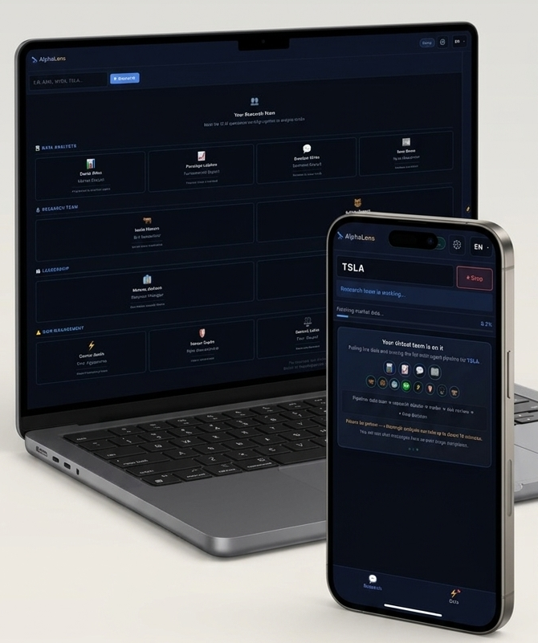
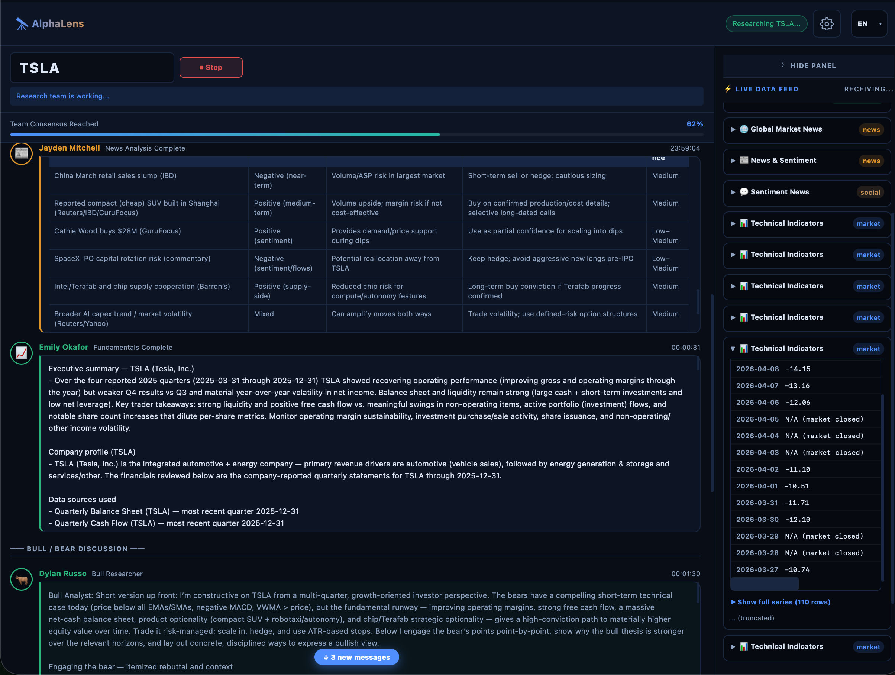
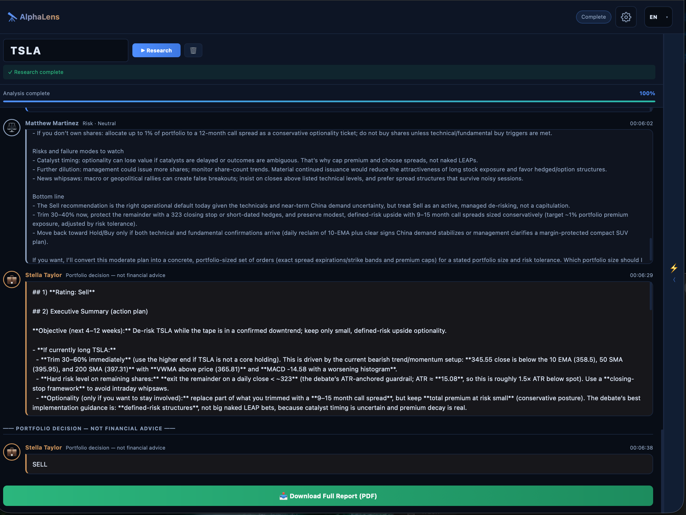

# AlphaLens — AI stock research

**AlphaLens** is a web application that turns the multi-agent [TradingAgents](https://github.com/TauricResearch/TradingAgents) research framework into a **hosted experience**: open your browser, enter a ticker, and watch analysts, researchers, risk reviewers, and a portfolio-style decision layer work together—without installing Python, cloning repositories, or running a terminal.

<div align="center">

[](https://alphalens-agent.onrender.com)

[English](#lang-en) · [Español](#lang-es) · [简体中文](#lang-zh) · [繁體中文](#lang-zh-hant) · [日本語](#lang-ja)

</div>

---

<a id="lang-en"></a>

## English

### Try it

**[https://alphalens-agent.onrender.com](https://alphalens-agent.onrender.com)**

The interface is **fully localized**: use the **language** menu in the header to run the whole experience—including **UI labels, agent dialogue, and PDF reports**—in your preferred language. Supported today:

| | |
| :--- | :--- |
| **English** | Default |
| **Español** | Spanish |
| **简体中文** | Simplified Chinese |
| **繁體中文** | Traditional Chinese |
| **日本語** | Japanese |

Works on **desktop and mobile** (responsive layout and touch-friendly controls). Bring your own API keys for the LLM providers you use (configurable in **Settings** on the site).

<a id="screenshots"></a>

### Screenshots

<p align="center">
  <b>Desktop &amp; mobile</b><br>
  
</p>

<p align="center">
  <b>Analysis in progress</b><br>
  
</p>

<p align="center">
  <b>Report &amp; outcome</b><br>
  
</p>

<p align="center">
  <em>Same workflow on large and small screens. While a run is active, follow the research stream and live data; when it finishes, review the summary and download the <strong>PDF report</strong>.</em>
</p>

### Built on TradingAgents

This project is a **second-generation product** on top of **TradingAgents** by [Tauric Research](https://github.com/TauricResearch/TradingAgents): the same multi-agent ideas (market, fundamentals, sentiment, news, bull/bear debate, trader, risk debate, final decision), packaged for **non-developers** and **zero setup**. Upstream research and licensing are acknowledged in **[NOTICE](NOTICE)**; this codebase is distributed under **Apache-2.0** (see **[LICENSE](LICENSE)**).

### What you get

**Zero installation, pure web** — No conda, no `pip install`, no local server.

**Multi-language analysis** — Header language drives UI, prompts, and PDF output (see table above).

**Live research feed and raw data** — Research chat streams in real time; the data feed shows tool-backed fetches and previews.

**PDF reports** — Download a structured PDF after completion.

**Approachable UX** — Ticker search, one **Research** action, optional **Settings** for models and keys.

### How the research flow works (conceptually)

1. **Data analysts** pull market, fundamentals, social, and news context (via configured data providers).
2. **Bull and bear researchers** stress-test the story in debate rounds.
3. A **research manager** synthesizes the thread.
4. A **trader** proposes a direction.
5. **Risk roles** (aggressive, conservative, neutral) debate constraints.
6. A **portfolio-style step** produces a clear **BUY / SELL / HOLD**-style outcome for the session—still **research and education only**, not personalized advice.

### Important disclaimer

AlphaLens is for **research and education**. Outputs are **AI-generated simulations**, not investment, legal, or tax advice. Markets are risky; always do your own diligence.

### Citing the underlying research

If you use ideas from the original TradingAgents paper, cite it as the authors request. Example (check [arXiv](https://arxiv.org/abs/2412.20138) for the latest BibTeX):

```bibtex
@misc{xiao2025tradingagentsmultiagentsllmfinancial,
      title={TradingAgents: Multi-Agents LLM Financial Trading Framework},
      author={Yijia Xiao and Edward Sun and Di Luo and Wei Wang},
      year={2025},
      eprint={2412.20138},
      archivePrefix={arXiv},
      primaryClass={q-fin.TR},
      url={https://arxiv.org/abs/2412.20138},
}
```

### Repository notes

- **Upstream:** [TauricResearch/TradingAgents](https://github.com/TauricResearch/TradingAgents)  
- **License:** Apache-2.0 — see `LICENSE` and `NOTICE`  
- **Hosted app:** [alphalens-agent.onrender.com](https://alphalens-agent.onrender.com)

Contributions and issues are welcome as this project evolves.

---

<a id="lang-es"></a>

## Español

**AlphaLens** es una aplicación web basada en [TradingAgents](https://github.com/TauricResearch/TradingAgents): análisis multiagente con acceso solo desde el navegador, sin instalar entornos ni usar la terminal.

### Pruébalo

**[https://alphalens-agent.onrender.com](https://alphalens-agent.onrender.com)**

El sitio admite **varios idiomas** igual que la app: en el menú **Language / 语言** del encabezado puedes elegir **English**, **Español**, **简体中文**, **繁體中文** o **日本語**. La interfaz, los mensajes de los agentes y los **informes PDF** siguen el idioma seleccionado. Funciona en **escritorio y móvil**; configura tus claves de API en **Settings**.

**Capturas de pantalla:** [arriba en esta página](#screenshots) (vista multi-dispositivo, análisis en curso, informe final).

Licencia y atribución: ver **[NOTICE](NOTICE)** y **[LICENSE](LICENSE)**. Más detalle técnico y citas: [sección English](#lang-en).

---

<a id="lang-zh"></a>

## 简体中文

**AlphaLens** 是基于 [TradingAgents](https://github.com/TauricResearch/TradingAgents) 的多智能体股票研究网页应用：无需安装 Python 或本地服务，在浏览器中即可完成流程。

### 立即体验

**[https://alphalens-agent.onrender.com](https://alphalens-agent.onrender.com)**

应用支持与应用内一致的多语言：在顶部 **语言** 选择器可选用 **English**、**Español**、**简体中文**、**繁體中文**、**日本語**。界面文案、智能体输出与 **PDF 报告** 均随所选语言切换。支持 **桌面与手机**；在 **Settings** 中配置各 LLM 服务商的 API 密钥。

**界面截图：** 见本页 [Screenshots](#screenshots)（多设备、分析进行中、报告结果）。

许可与致谢见 **[NOTICE](NOTICE)**、**[LICENSE](LICENSE)**。完整说明与引用见 [English](#lang-en)。

---

<a id="lang-zh-hant"></a>

## 繁體中文

**AlphaLens** 是以 [TradingAgents](https://github.com/TauricResearch/TradingAgents) 為基礎的多代理人股票研究網頁應用：無需安裝 Python 或本機服務，使用瀏覽器即可操作。

### 立即體驗

**[https://alphalens-agent.onrender.com](https://alphalens-agent.onrender.com)**

與應用程式相同，網站支援多語系：在頂端 **語言** 選單可選 **English**、**Español**、**简体中文**、**繁體中文**、**日本語**。介面、代理人輸出與 **PDF 報告** 皆會隨語系切換。支援 **桌面與手機**；於 **Settings** 設定各 LLM 服務的 API 金鑰。

**畫面截圖：** 見本頁 [Screenshots](#screenshots)（多裝置、分析進行中、報告結果）。

授權與致謝見 **[NOTICE](NOTICE)**、**[LICENSE](LICENSE)**。完整說明與引用見 [English](#lang-en)。

---

<a id="lang-ja"></a>

## 日本語

**AlphaLens** は、[TradingAgents](https://github.com/TauricResearch/TradingAgents) をベースにしたマルチエージェント型の株式リサーチ Web アプリです。Python のインストールやローカルサーバーは不要で、ブラウザだけで利用できます。

### 使ってみる

**[https://alphalens-agent.onrender.com](https://alphalens-agent.onrender.com)**

アプリと同様、**English / Español / 简体中文 / 繁體中文 / 日本語** からヘッダーの言語メニューで選択できます。**UI・エージェントの出力・PDF レポート** が選択した言語に合わせて表示されます。**デスクトップとモバイル** に対応。API キーは **Settings** で設定してください。

**スクリーンショット：** このページの [Screenshots](#screenshots) を参照（マルチデバイス、分析中、レポート）。

ライセンスと帰属は **[NOTICE](NOTICE)** と **[LICENSE](LICENSE)** を参照。詳細と引用は [English](#lang-en) を参照してください。
