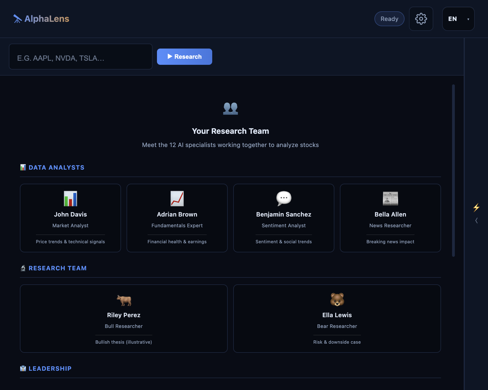
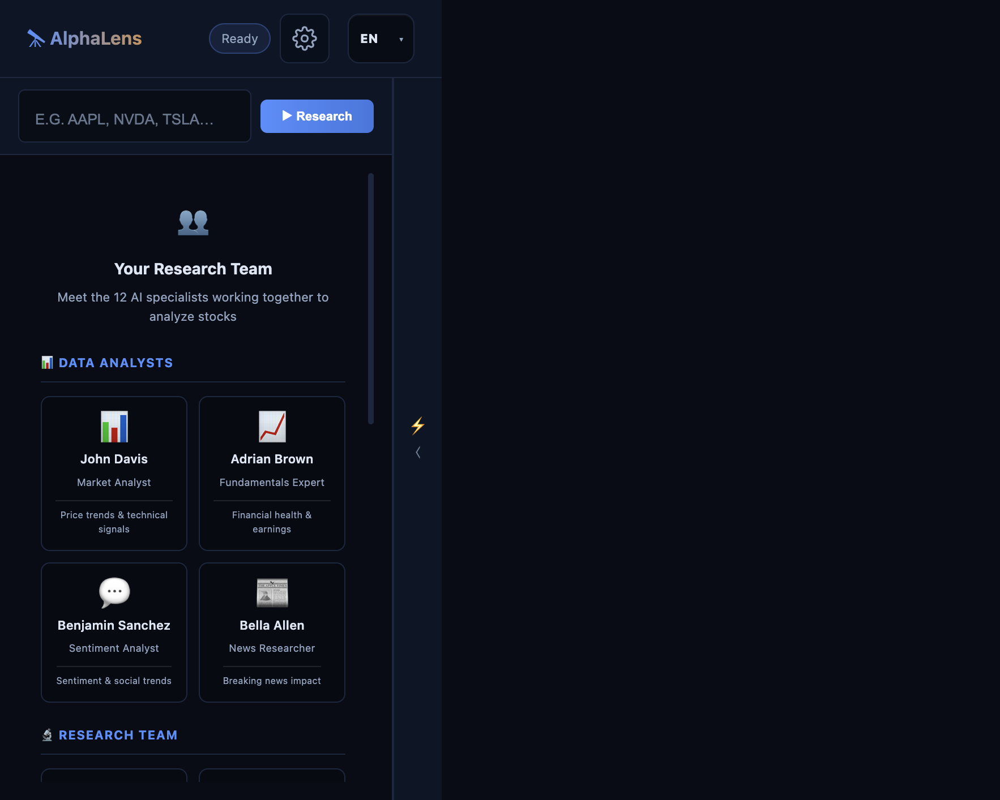
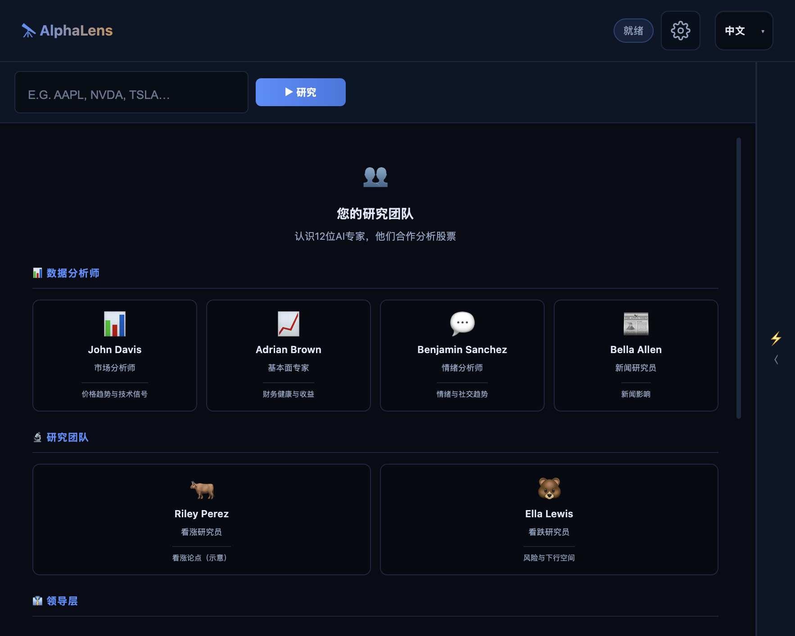
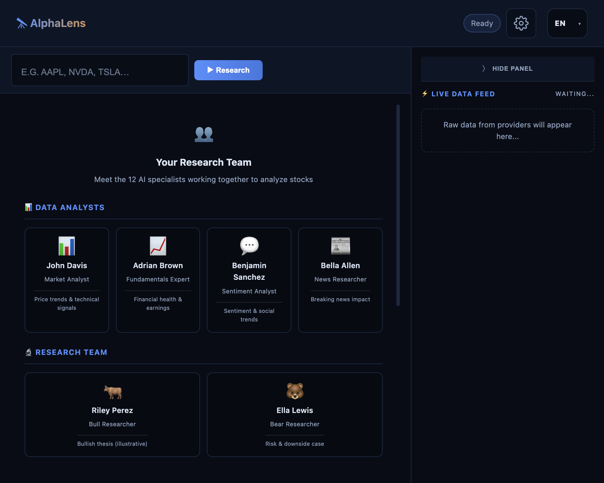

# AlphaLens — AI stock research

**AlphaLens** is a web application that turns the multi-agent [TradingAgents](https://github.com/TauricResearch/TradingAgents) research framework into a **hosted experience**: open your browser, enter a ticker, and watch analysts, researchers, risk reviewers, and a portfolio-style decision layer work together—without installing Python, cloning repositories, or running a terminal.

<div align="center">

[](https://alphalens-agent.onrender.com)

</div>

---

## Try it

**[https://alphalens-agent.onrender.com](https://alphalens-agent.onrender.com)**

Works on **desktop and mobile** (responsive layout and touch-friendly controls). Bring your own API keys for the LLM providers you use (configurable in **Settings** on the site).

---

## Built on TradingAgents

This project is a **second-generation product** on top of **TradingAgents** by [Tauric Research](https://github.com/TauricResearch/TradingAgents): the same multi-agent ideas (market, fundamentals, sentiment, news, bull/bear debate, trader, risk debate, final decision), packaged for **non-developers** and **zero setup**. Upstream research and licensing are acknowledged in **[NOTICE](NOTICE)**; this codebase is distributed under **Apache-2.0** (see **[LICENSE](LICENSE)**).

---

## What you get

### Zero installation, pure web

No conda, no `pip install`, no local server. If you can use a website, you can use AlphaLens.

### Multi-language analysis

Choose a **language** in the header and the experience adapts: **UI labels** and **agent prompts** align so outputs (and PDFs) can follow **English, Spanish, Japanese, Simplified Chinese, or Traditional Chinese**—so you can read the same workflow in the language you prefer.

### Live research feed and raw data

As a run progresses, the **research chat** streams analyst and debate messages in real time. The **live data feed** shows tool-backed fetches and previews so you can see *what* the agents looked at, not only their conclusions.

### PDF reports

When a run completes, you can **download a PDF** that summarizes the structured report (cover, sections, and decision context)—handy for archiving or sharing.

### Designed to be approachable

Ticker search, one primary **Research** action, optional **Settings** for models and keys, and clear disclaimers: built for people who care about stocks and ideas, not about devops.

---

## Screenshots

<p align="center">
  <b>Desktop — home & research team</b><br>
  
</p>

<p align="center">
  <b>Mobile layout</b><br>
  
</p>

<p align="center">
  <b>Multi-language UI (example: Chinese)</b><br>
  
</p>

<p align="center">
  <b>Live data feed (side panel)</b><br>
  
</p>

*After you run an analysis, the data feed fills with cards per analyst/tool; when finished, use the on-page controls to download the **PDF report**.*

---

## How the research flow works (conceptually)

1. **Data analysts** pull market, fundamentals, social, and news context (via configured data providers).
2. **Bull and bear researchers** stress-test the story in debate rounds.
3. A **research manager** synthesizes the thread.
4. A **trader** proposes a direction.
5. **Risk roles** (aggressive, conservative, neutral) debate constraints.
6. A **portfolio-style step** produces a clear **BUY / SELL / HOLD**-style outcome for the session—still **research and education only**, not personalized advice.

---

## Important disclaimer

AlphaLens is for **research and education**. Outputs are **AI-generated simulations**, not investment, legal, or tax advice. Markets are risky; always do your own diligence.

---

## Citing the underlying research

If you use ideas from the original TradingAgents paper, cite it as the authors request. Example (check [arXiv](https://arxiv.org/abs/2412.20138) for the latest BibTeX):

```bibtex
@misc{xiao2025tradingagentsmultiagentsllmfinancial,
      title={TradingAgents: Multi-Agents LLM Financial Trading Framework},
      author={Yijia Xiao and Edward Sun and Di Luo and Wei Wang},
      year={2025},
      eprint={2412.20138},
      archivePrefix={arXiv},
      primaryClass={q-fin.TR},
      url={https://arxiv.org/abs/2412.20138},
}
```

---

## Repository notes

- **Upstream:** [TauricResearch/TradingAgents](https://github.com/TauricResearch/TradingAgents)  
- **License:** Apache-2.0 — see `LICENSE` and `NOTICE`  
- **Hosted app:** [alphalens-agent.onrender.com](https://alphalens-agent.onrender.com)

Contributions and issues are welcome as this project evolves.
